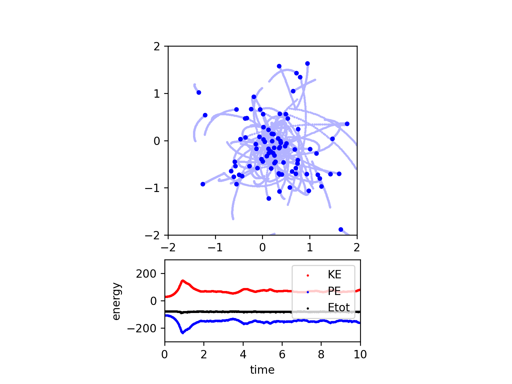

# nbody-python
Vectorized N-body code (Python)

## Create Your Own N-body Simulation (With Python)

### Philip Mocz (2020) Princeton Univeristy, [@PMocz](https://twitter.com/PMocz)

### [📝 Read the Algorithm Write-up on Medium](https://medium.com/swlh/create-your-own-n-body-simulation-with-python-f417234885e9)

Simulate orbits of stars interacting due to gravity

Code calculates pairwise forces according to Newton's Law of Gravity

```
python nbody.py
```



Running the Simulation with runner.py
You can use the runner.py script to run the N-body simulation with different implementations. The script supports multiple modes: original, cython, dask, pytorch, and pure.


Usage
To run the simulation, use the following command:

```
python runner.py -mode <mode> -N <number_of_particles> -t <current_time> -t_end <end_time> -dt <time_step> -softening <softening_length> -G <gravitational_constant> [--plot_real_time] [--measure_time]
```

The arguments are as follows:
Arguments  
-mode: Choose the execution mode. Options are original, cython, dask, pytorch, and pure. Default is original.  
-N: Number of particles. Default is 100.  
-t: Current time of the simulation. Default is 0.  
-t_end: Time at which the simulation ends. Default is 10.0.  
-dt: Size of a timestep. Default is 0.01.  
-softening: Softening length. Default is 0.1.  
-G: Gravitational constant. Default is 1.0.  
--plot_real_time: Enable plotting as the simulation goes along. Default is False.  
--measure_time: Measure execution time. Default is True.    

Examples  
Run the simulation with the original implementation:  
```python runner.py -mode original -N 100 -t 0 -t_end 10.0 -dt 0.01 -softening 0.1 -G 1.0```  
Run the simulation with the Cython implementation:  
```python runner.py -mode cython -N 100 -t 0 -t_end 10.0 -dt 0.01 -softening 0.1 -G 1.0```  
Run the simulation with the Dask implementation:  
```python runner.py -mode dask -N 100 -t 0 -t_end 10.0 -dt 0.01 -softening 0.1 -G 1.0```  
Run the simulation with the PyTorch implementation:  
```python runner.py -mode pytorch -N 100 -t 0 -t_end 10.0 -dt 0.01 -softening 0.1 -G 1.0```  
Run the simulation with the pure Python implementation:  
```python runner.py -mode pure -N 100 -t 0 -t_end 10.0 -dt 0.01 -softening 0.1 -G 1.0```  

This project uses `uv` package manager. To run using `uv`:  
```uv run python runner.py -mode original -N 100 -t 0 -t_end 10.0 -dt 0.01 -softening 0.1 -G 1.0 ```

